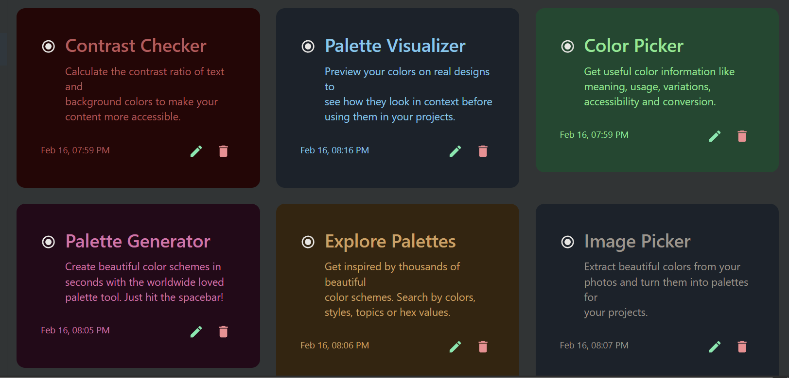

# NoteApp 📝

A simple and intuitive note‑taking application built with **React**, **Vite**, **Tailwind CSS**, and **Material UI**. It allows you to create, edit, delete, search, and filter notes, with each note customizable by color. All your notes are automatically saved in the browser's `localStorage` – so your data persists even after you close or refresh the page.

<div align="center">


</div>
<!-- 
<div align="center">
  
  <p><em>Dashboard Preview</em></p>
</div> -->

---

## Features ✨

- **Create, Edit, Delete Notes** – Full CRUD operations for managing your tasks.
- **Search Notes** – Quickly filter notes by text (title or content) in real-time.
- **Filter by Color** – Show only notes of a specific color (e.g., red, blue, green) or view all.
- **Color‑Coded Notes** – Each note can have its own background color, chosen from a palette when creating or editing.
- **Persistent Storage** – All notes are saved in `localStorage`. Your data stays with you locally without needing a backend.
- **Responsive Design** – Built with Tailwind CSS for a clean, mobile‑friendly interface.
- **Material UI Components** – Buttons, dialogs, inputs, and other UI elements from Material UI for a polished look and feel.

## Technologies Used 🛠️

- **React** – UI library with Hooks (`useState`, `useEffect`).
- **Vite** – Fast build tool and development server.
- **Tailwind CSS** – Utility‑first CSS framework for rapid styling.
- **Material UI** – Pre‑built React components for modals, buttons, inputs, etc.
- **LocalStorage** – Web storage API for client‑side persistence.

## Getting Started 🚀

Follow these steps to run the project locally.

### 📦 Prerequisites

- Node.js (v18 or higher)
- npm or yarn
- Modern web browser

### 🚀 Installation & Setup

1. **Clone the repository**
   ```bash
   git clone https://github.com/YOUR_USERNAME/NoteApp.git
   cd NoteApp
   ```

2. **Install Dependencies**
   ```bash
   npm install
   ```

3. **Run Development Server**
   ```bash
   npm run dev
   ```

4. **Open in Browser**
   Navigate to `http://localhost:5173` (or the port shown in your terminal).

## 📱 Device Support

- 📱 Smartphones
- 📱 Tablets  
- 💻 Desktop computers
- 🖥️ Large screens

## 📄 License

This project is open-source and available under the [MIT License](LICENSE).

## 🙏 Acknowledgments

- [React](https://reactjs.org/) - For building user interfaces
- [Vite](https://vitejs.dev/) - For fast development
- [Tailwind CSS](https://tailwindcss.com/) - For custom styling
- [Material UI](https://mui.com/) - For ready-made components
- [Lucide React](https://lucide.dev/) - For modern icons

## 📬 Contact

**Your Name**  
- Email: example@example.com  
- LinkedIn: [Your Profile](https://linkedin.com/in/yourprofile)  
- GitHub: [Your Username](https://github.com/yourusername)

---

<div align="center">

**Built with ❤️ using modern technologies 🚀**

</div>
```

## 📬 Contact

**Your Name**  
- Email: www.fahedammar2000@gmail.com
- LinkedIn: https://www.linkedin.com/in/fahd-ammar-2b30993b0
- GitHub: https://github.com/FahdAmmar

---