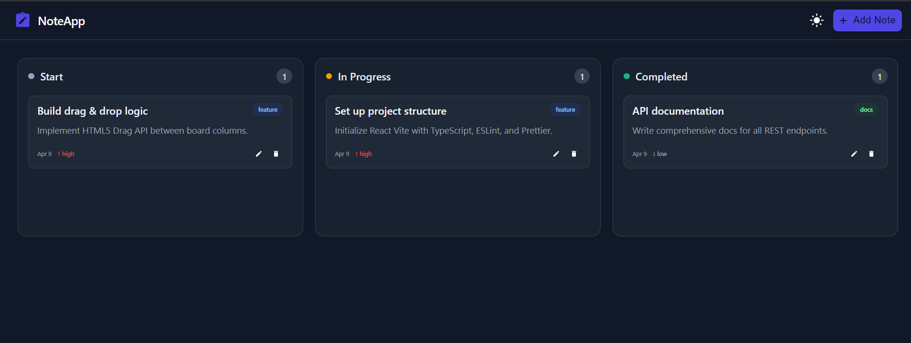

<div align="center">

# 📝 NoteApp

### A modern, responsive Kanban-style note management application

[](https://react.dev/)
[](https://www.typescriptlang.org/)
[](https://vitejs.dev/)
[](https://mui.com/)
[](https://tailwindcss.com/)
[](LICENSE)

<br/>

**NoteApp** is a full-featured, drag-and-drop note management board built with React, TypeScript, and Material UI. Organize your tasks across three stages — *Start*, *In Progress*, and *Completed* — with a clean, responsive interface that remembers your data and theme preference across sessions.

<br/>



</div>

---

## ✨ Features

### Core Functionality

- **Kanban Board** — Three-column layout: `Start`, `In Progress`, and `Completed`
- **Drag & Drop** — Seamlessly move notes between columns using the HTML5 Drag API
- **Full CRUD** — Create, read, update, and delete notes with an intuitive modal interface
- **Persistent Storage** — All notes and theme preference are saved to `localStorage` automatically
- **Theme Toggle** — Switch between Light and Dark mode; preference survives page refresh

### Note Properties

- **Title** — Short, descriptive heading (up to 60 characters)
- **Description** — Optional body text for additional context (up to 200 characters)
- **Tag** — Categorize notes: `feature`, `bug`, `design`, `docs`, `research`
- **Priority** — Set urgency level: `low`, `medium`, or `high` (with color-coded indicators)
- **Creation Date** — Automatically recorded when a note is created

### Design & UX

- **Fully Responsive** — Optimized for mobile, tablet, and desktop screens
- **Visual Drag Feedback** — Column highlights and card opacity changes during drag operations
- **Empty State UI** — Dashed drop-zone shown when a column has no notes
- **Color-coded Tags & Priorities** — Instant visual recognition of note type and urgency
- **Smooth Transitions** — CSS animations on card entry and theme switching

---

## 🛠 Technologies Used

| Category | Technology | Version | Purpose |
|---|---|---|---|
| **Framework** | [React](https://react.dev/) | ^18.3.1 | UI component library |
| **Language** | [TypeScript](https://www.typescriptlang.org/) | ^5.5.3 | Type safety & developer tooling |
| **Build Tool** | [Vite](https://vitejs.dev/) | ^5.4.1 | Fast dev server & production bundler |
| **UI Library** | [Material UI (MUI)](https://mui.com/) | ^5.16.7 | Pre-built accessible components |
| **MUI Icons** | [@mui/icons-material](https://mui.com/material-ui/material-icons/) | ^5.16.7 | Icon set |
| **Styling** | [Tailwind CSS](https://tailwindcss.com/) | ^3.4.10 | Utility-first CSS, dark mode |
| **CSS Processing** | [PostCSS](https://postcss.org/) | ^8.4.44 | Tailwind compilation pipeline |
| **CSS Prefixing** | [Autoprefixer](https://github.com/postcss/autoprefixer) | ^10.4.20 | Cross-browser CSS compatibility |
| **Unique IDs** | [uuid](https://github.com/uuidjs/uuid) | ^10.0.0 | Generate unique note identifiers |
| **Storage** | Browser `localStorage` | Native | Persist notes and theme across sessions |

---

## 📁 Project Structure

```
React-Note-App/
├── public/
│   └── vite.svg
├── src/
│   ├── components/
│   │   ├── AddNoteModal.tsx     # Modal for creating & editing notes
│   │   ├── NoteBoard.tsx        # Main board layout (three columns)
│   │   ├── NoteCard.tsx         # Individual draggable note card
│   │   ├── NoteColumn.tsx       # Droppable column with drag event handlers
│   │   └── TopBar.tsx           # App header with theme toggle & add button
│   ├── context/
│   │   └── ThemeContext.tsx     # Global dark/light theme state + localStorage
│   ├── hooks/
│   │   └── useNotes.ts          # All note state logic + localStorage persistence
│   ├── types/
│   │   └── note.ts              # TypeScript interfaces & type definitions
│   ├── App.tsx                  # Root component, MUI theme provider
│   ├── main.tsx                 # React DOM entry point
│   └── index.css                # Tailwind directives + global styles
├── index.html                   # HTML shell (must reference /src/main.tsx)
├── vite.config.ts               # Vite configuration (React plugin only)
├── tailwind.config.js           # Tailwind content paths + darkMode: "class"
├── postcss.config.js            # PostCSS plugins (tailwindcss + autoprefixer)
├── tsconfig.json                # TypeScript compiler options
└── package.json                 # Dependencies & scripts
```

---

## ✅ Prerequisites

Make sure you have the following installed before proceeding:

| Requirement | Minimum Version | Check Command |
|---|---|---|
| [Node.js](https://nodejs.org/) | v18.0.0+ | `node --version` |
| [npm](https://www.npmjs.com/) | v9.0.0+ | `npm --version` |
| A modern browser | Chrome / Edge / Firefox / Safari | — |

---

## 🚀 Installation

### 1 — Clone the repository

```bash
git clone https://github.com/your-username/react-note-app.git
cd react-note-app
```

### 2 — Install dependencies

```bash
npm install
```

> **Important:** This project requires **Tailwind CSS v3**. If you encounter Tailwind-related errors, run:
>
> ```bash
> npm uninstall @tailwindcss/vite tailwindcss
> npm install -D tailwindcss@3 autoprefixer postcss
> ```

### 3 — Verify configuration files exist

Ensure these three files are present in the project root:

```bash
# tailwind.config.js
# postcss.config.js
# vite.config.ts  ← must NOT import @tailwindcss/vite
```

### 4 — Start the development server

```bash
npm run dev
```

The application will be available at **[http://localhost:5173](http://localhost:5173)**

### 5 — Build for production

```bash
npm run build
```

Production files will be output to the `dist/` directory.

### 6 — Preview the production build

```bash
npm run preview
```

---

## 📖 Usage

### Adding a Note

1. Click the **`+ Add Note`** button in the top-right corner
2. Fill in the **Title** (required), **Description** (optional), **Tag**, and **Priority**
3. Click **Save Note** — the note appears in the **Start** column

### Editing a Note

1. Hover over any note card to reveal the action icons
2. Click the ✏️ **edit icon** to open the note in edit mode
3. Modify any field and click **Update**

### Deleting a Note

1. Hover over any note card
2. Click the 🗑 **delete icon** — the note is removed immediately

### Moving Notes (Drag & Drop)

1. **Click and hold** any note card
2. **Drag** it to the target column (`Start`, `In Progress`, or `Completed`)
3. **Release** — the note moves and is saved automatically

### Switching Theme

Click the **🌙 / ☀️ icon** in the top-right bar to toggle between Dark and Light mode. Your preference is saved and restored on the next visit.

---

## ⌨️ Keyboard & Interaction Guide

| Action | How to trigger |
|---|---|
| Open Add Note modal | Click `+ Add Note` button |
| Close modal | Click `Cancel` or click outside the modal |
| Save note | Click `Save Note` (Title must not be empty) |
| Start drag | Click and hold a note card |
| Drop note | Release over a target column |
| Edit note | Click ✏️ icon on the card |
| Delete note | Click 🗑️ icon on the card |
| Toggle theme | Click 🌙 / ☀️ icon in the top bar |

---

## 💾 localStorage Schema

NoteApp stores two keys in the browser's `localStorage`:

### `noteapp_notes`

Stores the full array of notes as a JSON string.

```json
[
  {
    "id": "a3f2c1d4-...",
    "title": "Set up project structure",
    "body": "Initialize React Vite with TypeScript and configure ESLint.",
    "tag": "feature",
    "priority": "high",
    "column": "start",
    "createdAt": "Apr 9"
  }
]
```

### `noteapp_theme`

Stores the user's theme preference as a plain string.

```
"dark"   // or
"light"
```

> **Note:** If `noteapp_theme` is absent (first visit), the app detects the OS preference via `prefers-color-scheme` automatically.

---

## 📄 License

This project is licensed under the **MIT License**.

---

<div align="center">

Made with ❤️ using React + TypeScript + Material UI

⭐ If you found this project helpful, please consider giving it a star on GitHub!

</div>
